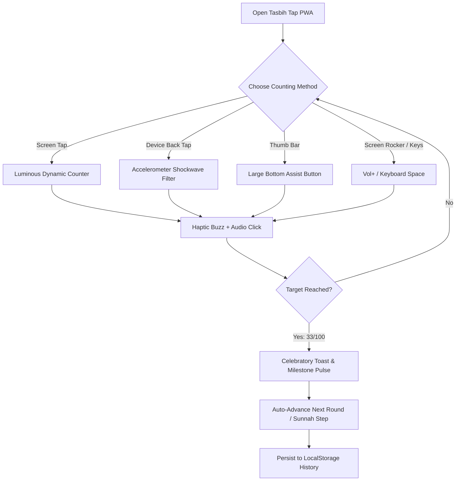

<div align="center">

# ﷽
### *بِسْمِ ٱللَّهِ ٱلرَّحْمَٰنِ ٱلرَّحِيمِ*
> *"Unquestionably, by the remembrance of Allah hearts are assured."*  
> — **Surah Ar-Ra'd (13:28)**

<br/>

# 📿 Tasbih Tap (تسبيح تـاب)
### **Modern, Mindful & Distraction-Free Islamic PWA (Progressive Web App)**

[](https://web.dev/progressive-web-apps/)
[](https://github.com)
[](https://vercel.com)
[](https://github.com)
[](https://github.com)
[](https://github.com)
[](LICENSE)

<br/>

**Tasbih Tap** is a beautifully crafted, distraction-free Islamic Tasbih Progressive Web App (PWA). Designed specifically for heartfelt Ibadah (worship), it works natively on any phone, tablet, or desktop without requiring an app store download.

Featuring **Back-of-Device Tap Detection**, **On-Screen Tactile Volume Rocker**, **One-Handed Thumb Bar**, **33×3 Sunnah Automation**, and **Offline-First Service Worker**.

**Zero Ads • Zero External Telemetry • 100% Offline • Installable on iOS & Android**

</div>

---

## 🌟 Why Tasbih Tap PWA?

Traditional counter apps are cluttered with intrusive full-screen video ads, noisy banners, and battery-draining background trackers that disrupt Khushu' (spiritual focus). 

**Tasbih Tap PWA** brings the ultimate peace of mind:

```
+-------------------------------------------------------------------------------+
|                                 TASBIH TAP PWA                                |
|                                                                               |
|   📲 Back-Tap Counting     │  🔘 Hardware & Rocker Keys│  🕊️ 100% Ad-Free       |
|   Double tap device back   │  Volume buttons, on-screen│  Zero ads or popups  |
|   to count with closed eyes│  rocker, & keyboard keys  │  ever interrupt zikr |
|   ─────────────────────────┼─────────────────────────┼─────────────────────── |
|   📿 33×3 Sunnah Mode      │  🤲 12+ Authentic Azkar │  ⚡ Instant PWA Install|
|   Auto-advance through     │  Arabic, translations   │  Add to Home Screen on |
|   post-salah tasbihat      │  in English & বাংলা     │  iOS, Android, & PC    |
+-------------------------------------------------------------------------------+
```

---

## 🚀 Live Deployment on Vercel

Tasbih Tap is a pure, zero-dependency static PWA that deploys instantly on **Vercel** with zero build configuration!

### Option 1: Deploy with Vercel CLI (Fastest)

```bash
# 1. Install Vercel CLI (if not already installed)
npm install -g vercel

# 2. Login to your Vercel account
vercel login

# 3. Deploy from the repository root
vercel --prod
```

### Option 2: Deploy via Vercel Web Dashboard

1. Push your repository to **GitHub**.
2. Go to [vercel.com/new](https://vercel.com/new).
3. Import your **tasbih-tap** repository.
4. Leave **Framework Preset** as **Other** (Static HTML/JS).
5. Leave Root Directory as `./` and click **Deploy**!
6. Your app is live with SSL, global CDN, and automatic PWA installation!

---

## 📲 How to Install as an App (PWA)

### On iPhone & iPad (iOS Safari)
1. Open your deployed Vercel URL in **Safari**.
2. Tap the **Share** button (box with an arrow pointing up).
3. Scroll down and tap **"Add to Home Screen"** (হোম স্ক্রিনে যোগ করুন).
4. Tap **Add**. The app will now appear on your home screen and open full-screen like a native iOS app!

### On Android (Chrome / Edge / Samsung Internet)
1. Open your deployed URL in **Chrome**.
2. Tap the **Install App** banner at the bottom or open the menu (⋮) and tap **"Install application"** / **"Add to Home screen"**.
3. Tasbih Tap will be added to your app drawer and home screen.

### On PC / Mac / Chromebook (Chrome or Edge)
1. Look for the **Install icon** in the browser URL address bar (top right).
2. Click **Install**. Launch it anytime as an independent desktop app.

---

## ✨ Standout Features

### 📲 1. Revolutionary "Smart Back-Tap" Counting
*Count your Dhikr without looking at your screen.*
- **Accelerometer Shockwave Filtering**: Utilizes the browser's `DeviceMotionEvent` with dynamic Z-axis delta impulse calculations and debounce safeguards to register gentle double-taps on the back of your phone.
- **Eyes-Closed Ibadah**: Close your eyes during night prayer (Tahajjud), sit in the Masjid, or commute while your phone rests naturally in your palm.
- **Universal Support**: Full motion sensor permission support for iOS Safari and Android Chrome.

### 🔘 2. Multiple Flexible Ways to Count
Designed for complete physical comfort in any posture:
- **Luminous Circular Counter**: Tap anywhere on the large serene center canvas.
- **Big One-Handed Thumb Button**: Wide, tactile button at the bottom for easy one-handed thumb tapping.
- **Floating Screen-Edge Volume Rocker**: Virtual `VOL+` (count) and `VOL-` (undo) buttons fixed to the screen edge mimicking hardware keys.
- **Physical Keyboard Counting**: Press `Space`, `Arrow Up`, or `Enter` on any desktop/laptop to count; press `Arrow Down` to undo.
- **Bluetooth Headset & Media Buttons**: Integrated with the `MediaSession API`—count using your Bluetooth earphone play/next buttons!

### 🔄 3. Smart 33×3 Sunnah Mode & Target Presets
- **Automatic Post-Salah Misbaha**: Seamlessly flows through the beloved Sunnah after prayer:
  $$\text{SubhanAllah (33)} \longrightarrow \text{Alhamdulillah (33)} \longrightarrow \text{Allahu Akbar (34)}$$
- **Flexible Goals**: Select quick presets (**33, 99, 100, 1,000**) or set any custom target.
- **∞ Unlimited Mode**: Enjoy open-ended contemplation (*Muraqabah*) and continuous Istighfar without round limits.

### 🤲 4. Comprehensive Authentic Dhikr Library
Pre-loaded with authentic supplications sourced directly from the Quran and Sunnah, categorized for effortless discovery:

| Category | Transliteration | Arabic Calligraphy | Meaning (English & বাংলা) |
|:---|:---|:---:|:---|
| **Essential** | **SubhanAllah** | سُبْحَانَ اللَّهِ | *Glory be to Allah* / আল্লাহ অতি পবিত্র |
| **Essential** | **Alhamdulillah** | الْحَمْدُ لِلَّهِ | *All praise is due to Allah* / সকল প্রশংসা আল্লাহর |
| **Essential** | **Allahu Akbar** | اللَّهُ أَكْبَرُ | *Allah is the Greatest* / আল্লাহ সর্বশ্রেষ্ঠ |
| **Praise** | **La ilaha illallah** | لَا إِلٰهَ إِلَّا اللَّهُ | *There is no deity except Allah* |
| **Forgiveness** | **Astaghfirullah** | أَسْتَغْفِرُ اللَّهَ | *I seek forgiveness from Allah* / আমি ক্ষমা চাই |
| **Salawat** | **Salawat ‘Alan Nabi** | اللَّهُمَّ صَلِّ عَلَىٰ مُحَمَّدٍ | *Blessings upon the Prophet ﷺ* / দরূদ শরীফ |
| **Praise** | **SubhanAllahi wa bihamdihi** | سُبْحَانَ اللَّهِ وَبِحَمْدِهِ | *Glory and praise be to Allah* |
| **Praise** | **SubhanAllahil Azeem** | سُبْحَانَ اللَّهِ الْعَظِيمِ | *Glory be to Allah the Magnificent* |
| **Supplication** | **Hawqala** | لَا حَوْلَ وَلَا قُوَّةَ إِلَّا بِاللَّهِ | *No power nor strength except in Allah* |
| **Supplication** | **Hasbunallahu wa ni'mal wakeel** | حَسْبُنَا اللَّهُ وَنِعْمَ الْوَكِيلُ | *Allah is sufficient for us, the best Disposer* |
| **Forgiveness** | **Sayyidul Istighfar** | سَيِّدُ الاسْتِغْفَارِ | *The Chief Supplication for Forgiveness* |
| **Supplication** | **Ayat e Kareema (Dua of Yunus)** | لَّا إِلَٰهَ إِلَّا أَنتَ سُبْحَانَكَ | *There is no deity except You; Exalted are You!* |

> 🔍 **Instant Search & Category Filters**: Filter in real-time by *All, Essential, Forgiveness, Salawat, Supplication,* or *Praise*.

### 📳 5. Organic Audio & Haptic Feedback
- **Tactile Vibration**: Subtle physical buzz on Android phones via the `navigator.vibrate` API.
- **Wooden Bead Click Sound**: Ultra-lightweight synthesized click via the Web Audio API—recreates the gentle, organic sound of real wooden tasbih beads.
- **Milestone Celebration Pulse**: Special multi-pattern haptic vibration on reaching target completion (33, 100, etc.).

### 🎨 6. Six Sacred Islamic Color Palettes
Tailor the aesthetic to your surroundings and time of prayer:
- 🌿 **Emerald**: Inspired by the lush green dome and carpets of *Al-Masjid an-Nabawi*.
- 🌌 **Midnight**: Soothing deep oceanic navy with calm cyan accents.
- 📜 **Sand**: Warm Medina parchment and desert stone.
- 🌑 **Night (OLED Black)**: Pure AMOLED pitch black with subdued gold for eye comfort during *Tahajjud* and night prayers.
- 🌸 **Rose Gold**: Regal deep plum and shimmering rose luster.
- 👑 **Royal Amber**: Rich obsidian slate and radiant warm amber glow.

### 👁️ 7. Keep Screen Awake (Wake Lock API)
- Keeps the screen awake during long dhikr sessions so your device never dims or locks while you are actively reciting.

### 🌐 8. Complete Bilingual Localization
- Instant toggle between **বাংলা (Bengali)** and **English** for all menus, dhikr titles, meanings, and notifications.

---

## 📱 Interactive App Flow



---

## 🛠️ PWA Architecture & File Structure

```
tasbih-tap/
 ├── index.html           # Semantically structured responsive PWA interface
 ├── app.js               # Core engine: Back-tap filter, Audio synthesis, State, & DB
 ├── style.css            # Material 3 dark Islamic theme, animations & responsive grid
 ├── manifest.json        # Standalone PWA manifest, display config & icons
 ├── sw.js                # Offline Service Worker with Cache-First strategy
 ├── icon-192.png         # High-resolution PWA launcher icon (192x192)
 ├── icon-512.png         # High-resolution splash icon (512x512)
 └── README.md            # Documentation & setup guide
```

- **Frontend Tech**: Pure Modern Web Standards (HTML5, Modern CSS Variables, Vanilla ES6+ JavaScript)
- **Zero Build Step**: No complex Webpack, Vite, or Node build requirements—fast, robust, and future-proof.
- **Offline Storage**: LocalStorage + Service Worker Cache API.
- **Browser APIs**: DeviceMotionEvent, WakeLock API, Web Audio API, Web Vibration API, MediaSession API.

---

## 🛡️ Privacy & Philosophy

<div align="center">

| Feature | Tasbih Tap PWA | Typical Mobile Apps |
|:---|:---:|:---:|
| **Advertisements** | ❌ **ZERO (Never)** | ⚠️ Full-screen video ads |
| **Internet Access** | ❌ **Completely Offline** | ⚠️ Required for ad delivery |
| **Data Collection** | ❌ **NONE (Private)** | ⚠️ Trackers & analytics |
| **Installation** | ✅ **One-tap PWA** | ⚠️ App Store download |
| **Cross-Platform** | ✅ **iOS, Android, PC, Mac** | ⚠️ OS dependent |
| **Resource Usage** | 🟢 **< 1 MB footprint** | 🔴 50MB+ bundle size |

</div>

> **Our Commitment**: Your worship is sacred. An app designed for remembering Allah ﷻ should never profit from tracking your habits or flashing banners across your screen. Every byte of your Dhikr count remains solely on your physical device.

---

## 📖 The Virtues of Dhikr

> **The Prophet Muhammad ﷺ said:**  
> *"The comparison of the one who remembers his Lord and the one who does not is like that of the living and the dead."*  
> — **Sahih al-Bukhari (6407)**

> **He ﷺ also said:**  
> *"Two words are light on the tongue, heavy on the scale, and beloved to the Most Merciful: **SubhanAllahi wa bihamdihi, SubhanAllahil Azeem**."*  
> — **Sahih al-Bukhari (6682)**

---

## 🤝 Contributing & Feedback

Contributions and suggestions are warmly welcomed!
- 🐛 **Found an issue?** Open an issue on GitHub.
- 💡 **Have a Dhikr or feature suggestion?** Submit a Pull Request.
- ⭐ **Found this app beneficial?** Please star this repository to help other Muslims discover it!

---

## 📜 License & Credits

Distributed under the **MIT License**.

<div align="center">

```
   ♥ Made with devotion by ©munabbiRMushran
   Dedicated as a humble Sadaqah Jariyah for the Ummah.
```

**[اللَّهُمَّ أَعِنِّي عَلَى ذِكْرِكَ وَشُكْرِكَ وَحُسْنِ عِبَادَتِكَ]**  
*(O Allah, help me to remember You, give thanks to You, and worship You in the best manner)*

</div>
