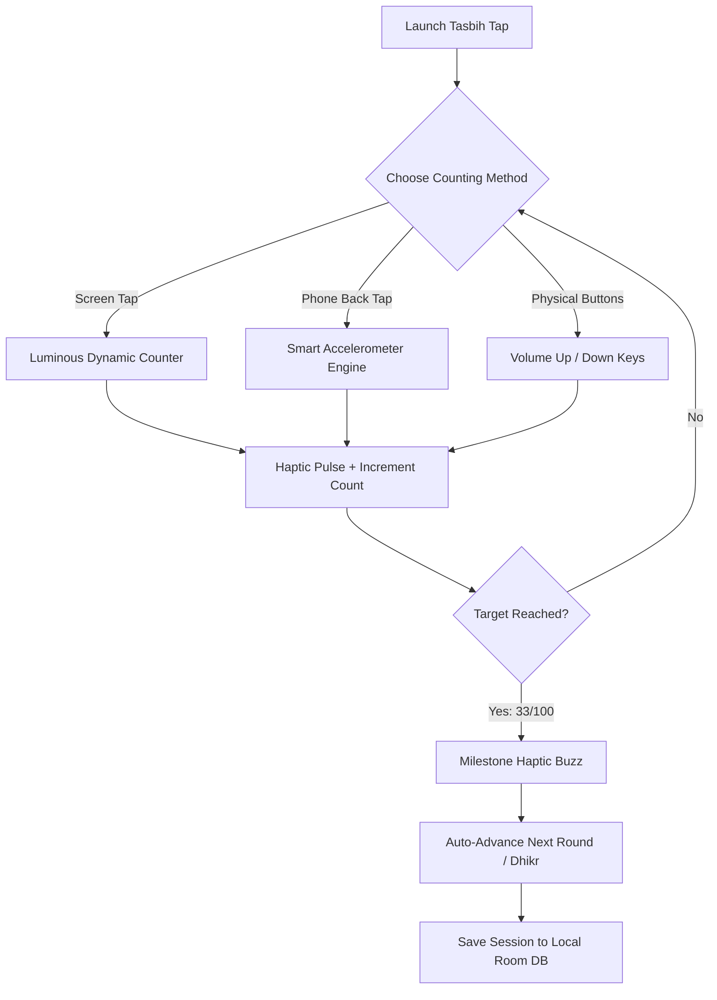

<div align="center">

# ﷽
### *بِسْمِ ٱللَّهِ ٱلرَّحْمَٰنِ ٱلرَّحِيمِ*
> *"Unquestionably, by the remembrance of Allah hearts are assured."*  
> — **Surah Ar-Ra\'d (13:28)**

<br/>

# 📿 Tasbih Tap (تسبيح تـاب)
### **The Modern, Mindful & Distraction-Free Digital Dhikr Companion**

[](https://developer.android.com)
[](https://kotlinlang.org)
[](https://developer.android.com/jetpack/compose)
[](https://developer.android.com/training/data-storage/room)
[](https://github.com)
[](https://github.com)
[](LICENSE)

<br/>

**Tasbih Tap** is a beautifully engineered, distraction-free Islamic Tasbih application built with modern Android (Jetpack Compose & Material 3). Designed specifically for heartfelt Ibadah (worship), it introduces groundbreaking **Back-of-Device Tap Detection**, allowing you to count your Dhikr naturally without looking at your screen.

**Zero Ads • Zero Internet Permissions • Zero Tracking • 100% Halal & Open Source**

</div>

---

## 🌟 Why Tasbih Tap?

Most digital tasbih apps on the store are cluttered with pop-up ads, audio blaring at the wrong times, battery-draining telemetry, and complex button layouts that distract you from the remembrance of Allah ﷻ. 

**Tasbih Tap** was crafted with one singular intention: **to bring pure tranquility, spiritual focus (Khushu\'), and tactile mindfulness back to your daily Dhikr.**

```
+-------------------------------------------------------------------------------+
|                                 TASBIH TAP                                    |
|                                                                               |
|   📳 Back-Tap Detection    │  🔋 Zero Battery Waste  │  🕊️ 100% Ad-Free       |
|   Count by gently tapping  │  Lightweight native     │  No pop-ups or banners |
|   the back of your phone   │  sensor processing      │  ever interrupt Dhikr  |
|   ─────────────────────────┼─────────────────────────┼─────────────────────── |
|   📿 33×3 Sunnah Mode      │  🤲 12+ Authentic Azkar │  🔒 100% Offline       |
|   Auto-advance through     │  Arabic, translations   │  Zero INTERNET perm;   |
|   post-salah tasbihat      │  in English & বাংলা     │  counts stay private   |
+-------------------------------------------------------------------------------+
```

---

## ✨ Standout Features

### 📲 1. Revolutionary "Smart Back-Tap" Counting
*Count your Dhikr without staring at the screen.*
- **Sensor Shockwave Filtering**: Employs accelerometer high-pass impulse algorithms with gyroscope stabilization to register gentle double-taps on the back of your phone.
- **Eyes-Closed Ibadah**: Close your eyes during night prayer (Tahajjud), sit in the Masjid, or commute on the train while your phone rests naturally in your hand.
- **Custom Sensitivity**: Calibrate detection to your liking (**Gentle**, **Balanced**, or **Firm**) with live visual confirmation.

### 🔘 2. Tactile Full-Screen Tap & Volume Key Counting
- **Full-Screen Serene Canvas**: Tap anywhere on the large, luminous circular counter with satisfying pulse animations and ripple effects.
- **Physical Volume Key Support**: Press `Volume Up` to count and `Volume Down` to undo—ideal for discreet counting with your phone inside your pocket.
- **Accidental Tap Guard & Undo**: Instant undo button with confirmation safeguards so your count is never lost.

### 🔄 3. Smart 33×3 Sunnah Mode & Target Presets
- **Automatic Post-Salah Misbaha**: Seamlessly flows through the beloved Sunnah after prayer:
  $$\text{SubhanAllah (33)} \longrightarrow \text{Alhamdulillah (33)} \longrightarrow \text{Allahu Akbar (34 / 33)}$$
- **Flexible Goals**: Select quick presets (**33, 99, 100, 1,000**) or set any custom target.
- **∞ Unlimited Mode**: Enjoy open-ended contemplation (*Muraqabah*) and continuous Istighfar without round limits.

### 🤲 4. Comprehensive Authentic Dhikr Library
Pre-loaded with authentic supplications sourced directly from the Quran and Sunnah, categorized for effortless discovery:

| Category | Transliteration | Arabic Calligraphy | English Meaning |
|:---|:---|:---:|:---|
| **Essential** | **SubhanAllah** | سُبْحَانَ اللَّهِ | *Glory be to Allah* |
| **Essential** | **Alhamdulillah** | الْحَمْدُ لِلَّهِ | *All praise is due to Allah* |
| **Essential** | **Allahu Akbar** | اللَّهُ أَكْبَرُ | *Allah is the Greatest* |
| **Praise** | **La ilaha illallah** | لَا إِلٰهَ إِلَّا اللَّهُ | *There is no deity except Allah* |
| **Forgiveness** | **Astaghfirullah** | أَسْتَغْفِرُ اللَّهَ | *I seek forgiveness from Allah* |
| **Salawat** | **Salawat ‘Alan Nabi** | اللَّهُمَّ صَلِّ عَلَىٰ مُحَمَّدٍ | *Blessings upon the Prophet ﷺ* |
| **Praise** | **SubhanAllahi wa bihamdihi** | سُبْحَانَ اللَّهِ وَبِحَمْدِهِ | *Glory and praise be to Allah* |
| **Praise** | **SubhanAllahil Azeem** | سُبْحَانَ اللَّهِ الْعَظِيمِ | *Glory be to Allah the Magnificent* |
| **Supplication** | **Hawqala** | لَا حَوْلَ وَلَا قُوَّةَ إِلَّا بِاللَّهِ | *No power nor strength except in Allah* |
| **Supplication** | **Hasbunallahu wa ni\'mal wakeel** | حَسْبُنَا اللَّهُ وَنِعْمَ الْوَكِيلُ | *Allah is sufficient for us, the best Disposer* |
| **Forgiveness** | **Sayyidul Istighfar** | سَيِّدُ الاسْتِغْفَارِ | *The Chief Supplication for Forgiveness* |
| **Supplication** | **Ayat e Kareema (Dua of Yunus)** | لَّا إِلَٰهَ إِلَّا أَنتَ سُبْحَانَكَ | *There is no deity except You; Exalted are You!* |

> 🔍 **Search & Category Filters**: Filter in real-time by *All, Essential, Forgiveness, Salawat, Supplication,* or *Praise*.

### ✍️ 5. Personal Custom Dhikr & Wazifa Creator
Add your personal daily litany, family wird, or custom verses:
- Custom Title & Transliteration
- Arabic Script input
- Configurable target count
- Saved locally to your private SQLite database

### 📳 6. Customizable Haptic Touch & Audio
- **3-Level Haptic Engine**: Choose between **Light**, **Medium**, or **Strong** tactile buzz for every counted bead.
- **Milestone Celebration Pulse**: Special multi-pattern haptic vibration on reaching target completion (33, 100, etc.).
- **Subtle Audio Click**: Optional organic wooden bead click sound toggle.

### 🎨 7. Six Sacred Islamic Color Palettes
Tailor the aesthetic to your surroundings and time of prayer:
- 🌿 **Emerald**: Inspired by the lush green dome and carpets of *Al-Masjid an-Nabawi*.
- 🌌 **Midnight**: Soothing deep oceanic navy with calm cyan accents.
- 📜 **Sand**: Warm Medina parchment and desert stone.
- 🌑 **Night (OLED Black)**: Pure AMOLED pitch black with subdued gold for eye comfort during *Tahajjud* and night prayers.
- 🌸 **Rose Gold**: Regal deep plum and shimmering rose luster.
- 👑 **Royal Amber**: Rich obsidian slate and radiant warm amber glow.

### 📊 8. Daily Habits & History Tracking
- Track **Today\'s Dhikr Total**, **Completed Target Streaks**, and **All-Time Lifetime Count**.
- Clean chronological timeline of completed sessions with exact timestamps and round counts.
- One-tap history reset with safe confirmation dialog.

### 🌐 9. Multilingual Support
Fully localized in **English** and **বাংলা (Bengali)**, including all Dhikr titles, meanings, category tags, and interface components.

---

## 📱 Interactive App Flow



---

## 🛡️ Privacy & Philosophy

<div align="center">

| Feature | Tasbih Tap | Traditional Tasbih Apps |
|:---|:---:|:---:|
| **Advertisements** | ❌ **ZERO (Never)** | ⚠️ Full-screen video ads |
| **Internet Access** | ❌ **NO Permission Requested** | ⚠️ Required for ad delivery |
| **Location / Telemetry Tracking** | ❌ **NONE** | ⚠️ Analytics & identifiers |
| **Offline Functionality** | ✅ **100% Fully Offline** | ⚠️ Degraded without connection |
| **Physical Back-Tap Support** | ✅ **Built-in Smart Sensor** | ❌ Not available |
| **Battery Consumption** | 🟢 **Ultra-low (0.1%)** | 🔴 High background sync |

</div>

> **Our Promise**: Your worship is sacred. We believe an app designed for remembering the Creator should never profit from tracking your habits or flashing banners across your screen. Every byte of your Dhikr count remains solely on your physical device.

---

## 📖 The Virtues of Dhikr

> **The Prophet Muhammad ﷺ said:**  
> *"The comparison of the one who remembers his Lord and the one who does not is like that of the living and the dead."*  
> — **Sahih al-Bukhari (6407)**

> **He ﷺ also said:**  
> *"Two words are light on the tongue, heavy on the scale, and beloved to the Most Merciful: **SubhanAllahi wa bihamdihi, SubhanAllahil Azeem**."*  
> — **Sahih al-Bukhari (6682)**

May this application be a source of continuous peace for your heart, consistent remembrance on your tongue, and *Sadaqah Jariyah* (continuous charity) for the Ummah.

---

## 🛠️ Tech Stack & Architecture

```
app/
 ├── data/
 │    ├── local/          # Room DB, DhikrDao, CustomDhikrEntity, DhikrSessionEntity
 │    └── sensor/         # BackTapDetector (High-Pass Filter + Gyroscope Fusion)
 ├── model/               # DhikrItem, DhikrPresets, TasbihTheme, HapticStrength
 ├── ui/
 │    ├── components/     # Islamic Geometric Canvas, Dynamic Top Action Cards
 │    ├── screens/        # CounterScreen, DhikrSelectionSheet, HistoryScreen, SettingsScreen
 │    └── theme/          # Material 3 Color Schemes & Shapes
 └── viewmodel/           # TasbihViewModel (StateFlow, Lifecycle-aware Sensors)
```

- **Framework**: Native Android SDK (Min SDK 26, Target SDK 36)
- **Language**: 100% Kotlin with Coroutines & StateFlow
- **UI Engine**: Jetpack Compose with Material Design 3 (M3)
- **Persistence**: Room Database (SQLite) + Jetpack DataStore / SharedPreferences
- **Hardware Integration**: Android SensorManager (Linear Accelerometer + Gyroscope) & VibratorManager Haptic Engine
- **Test Suite**: Robolectric JVM unit tests & Roborazzi visual regression framework

---

## 🚀 Getting Started & Building from Source

### Prerequisites
- Android Studio Ladybug (2024.2+) or newer
- JDK 17 or JDK 21
- Android device or emulator running Android 8.0 (API level 26) or above

### Installation
1. **Clone the repository**:
   ```bash
   git clone https://github.com/your-username/tasbih-tap.git
   cd tasbih-tap
   ```
2. **Open in Android Studio**:
   - Select **Open an Existing Project** and navigate to the cloned directory.
3. **Build the Debug APK**:
   ```bash
   ./gradlew assembleDebug
   ```
4. **Run Unit Tests**:
   ```bash
   ./gradlew testDebugUnitTest
   ```

---

## 🤝 Contributing & Feedback

Contributions, suggestions, and feature requests are warmly welcomed!
- 🐛 **Found a bug?** Open an issue on GitHub.
- 💡 **Have a Dhikr or Dua suggestion?** Submit a Pull Request.
- ⭐ **Found this app beneficial?** Please star this repository to help other Muslims discover it!

---

## 📜 License & Credits

Distributed under the **MIT License**. See `LICENSE` for more information.

<div align="center">

```
   ♥ Made with devotion by ©munabbiRMushran
   Dedicated as a humble Sadaqah Jariyah for the Ummah.
```

**[اللَّهُمَّ أَعِنِّي عَلَى ذِكْرِكَ وَشُكْرِكَ وَحُسْنِ عِبَادَتِكَ]**  
*(O Allah, help me to remember You, give thanks to You, and worship You in the best manner)*

</div>
