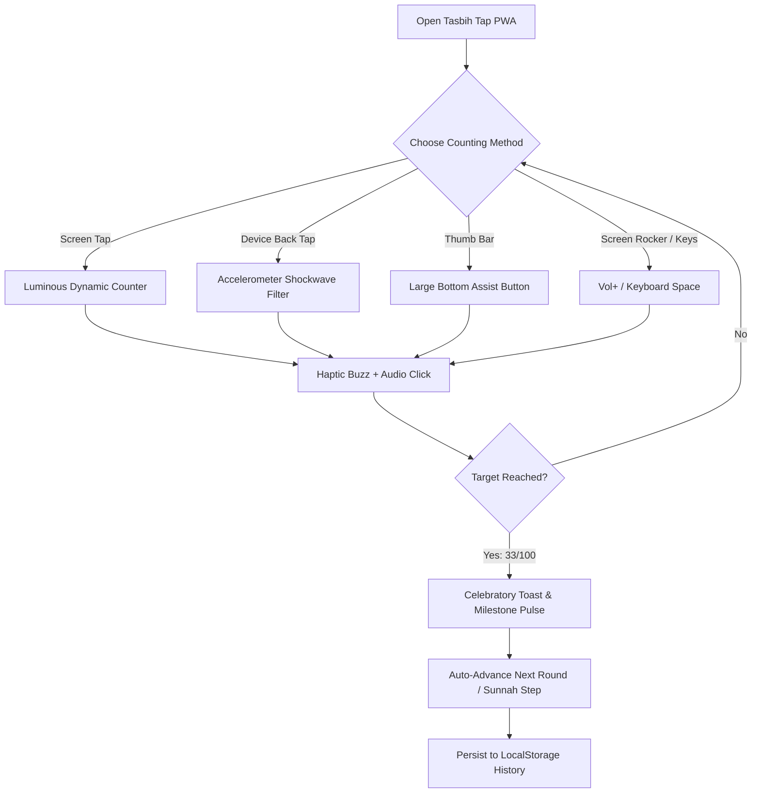

<div align="center">

# ﷽
### *بِسْمِ ٱللَّهِ ٱلرَّحْمَٰنِ ٱلرَّحِيمِ*
> *"Unquestionably, by the remembrance of Allah hearts are assured."*  
> — **Surah Ar-Ra'd (13:28)**

<br/>

# 📿 Tasbih Tap (تسبيح تـاب)
### **Modern, Mindful & Distraction-Free Islamic PWA (Progressive Web App)**

[](https://tasbihtap.vercel.app/)
[](https://web.dev/progressive-web-apps/)
[](https://tasbihtap.vercel.app/)
[](https://tasbihtap.vercel.app/)
[](https://tasbihtap.vercel.app/)
[](https://tasbihtap.vercel.app/)
[](https://tasbihtap.vercel.app/)
[](LICENSE)

<br/>

### 🌐 **Live Web App / সরাসরি ব্যবহার করুন**:  
👉 **[https://tasbihtap.vercel.app](https://tasbihtap.vercel.app/)** 👈

<br/>

**Tasbih Tap** is a beautifully crafted, distraction-free Islamic Tasbih Progressive Web App (PWA). Designed specifically for heartfelt Ibadah (worship), it works natively on any phone, tablet, or desktop without requiring an app store download.

Featuring **Back-of-Device Tap Detection**, **On-Screen Tactile Volume Rocker**, **One-Handed Thumb Bar**, **33×3 Sunnah Automation**, and **Offline-First Service Worker**.

**Zero Ads • Zero External Telemetry • 100% Offline • Installable on iOS & Android**

</div>

---

## 🌟 Why Tasbih Tap PWA?

Traditional counter apps are cluttered with intrusive full-screen video ads, noisy banners, and battery-draining background trackers that disrupt Khushu' (spiritual focus). 

**Tasbih Tap PWA** brings the ultimate peace of mind:

```
+-------------------------------------------------------------------------------+
|                                 TASBIH TAP PWA                                |
|                                                                               |
|   📲 Back-Tap Counting     │  🔘 Hardware & Rocker Keys│  🕊️ 100% Ad-Free       |
|   Double tap device back   │  Volume buttons, on-screen│  Zero ads or popups  |
|   with sensitivity controls│  rocker, & keyboard keys  │  ever interrupt zikr |
|   ─────────────────────────┼─────────────────────────┼─────────────────────── |
|   📿 33×3 Sunnah Mode      │  🤲 30+ Authentic Azkar │  ⚡ Instant PWA Install|
|   Auto-advance through     │  Arabic, English & বাংলা│  1-Tap Install on iOS, |
|   post-salah tasbihat      │  complete translations  │  Android, & PC/Mac     |
+-------------------------------------------------------------------------------+
```

---

## 🚀 Live Production URL

The progressive web app is deployed and available globally at:

🔗 **[https://tasbihtap.vercel.app](https://tasbihtap.vercel.app/)**

---

## 📲 How to Install as an App (PWA)

### On iPhone & iPad (iOS Safari)
1. Open **[https://tasbihtap.vercel.app](https://tasbihtap.vercel.app/)** in **Safari**.
2. Tap the **Share** button (the square icon with an arrow pointing up).
3. Scroll down and tap **"Add to Home Screen"** (হোম স্ক্রিনে যোগ করুন).
4. Tap **Add**. The app will now appear on your home screen and open full-screen like a native iOS app!

### On Android (Chrome / Edge / Samsung Internet)
1. Open **[https://tasbihtap.vercel.app](https://tasbihtap.vercel.app/)** in **Chrome**.
2. Tap the **"Add Tasbih Tap to Home screen"** / **"Install app"** banner, or tap the top-right menu (⋮) and select **"Install application"** / **"Add to Home screen"**.
3. Tasbih Tap will be added to your app drawer and home screen with an app icon.

### On PC / Mac / Chromebook (Chrome or Edge)
1. Open **[https://tasbihtap.vercel.app](https://tasbihtap.vercel.app/)** in **Google Chrome** or **Microsoft Edge**.
2. Look for the **Install icon** in the address bar (top right).
3. Click **Install**. You can now launch it directly from your desktop or dock!

---

## ✨ Standout Features

### 📲 1. Revolutionary "Smart Back-Tap" with Sensitivity Control
*Count your Dhikr without looking at your screen.*
- **Customizable Sensitivity Levels**: Choose between **Low (কম)**, **Medium (মাঝারি)**, or **High (বেশি)** sensitivity in Settings to match your phone's weight and cover case.
- **Accelerometer Shockwave Filtering**: Utilizes the browser's `DeviceMotionEvent` with dynamic Z-axis delta impulse calculations and debounce safeguards to register gentle double-taps on the back of your phone.
- **Eyes-Closed Ibadah**: Close your eyes during night prayer (Tahajjud), sit in the Masjid, or commute while your phone rests naturally in your palm.
- **Universal Support**: Full motion sensor permission support for iOS Safari and Android Chrome.

### ⚡ 2. One-Tap PWA App Installation
- **Instant 1-Tap Header Button**: Prominent install button on the top header and in Settings that triggers native PWA installation via `beforeinstallprompt` with zero friction.
- **Works Offline**: Once installed, open it anytime like a native mobile app even without an internet connection.

### 🔘 3. Multiple Flexible Ways to Count
Designed for complete physical comfort in any posture:
- **Luminous Circular Counter**: Tap anywhere on the large serene center canvas.
- **Big One-Handed Thumb Button**: Wide, tactile button at the bottom for easy one-handed thumb tapping.
- **Floating Screen-Edge Volume Rocker**: Virtual `VOL+` (count) and `VOL-` (undo) buttons fixed to the screen edge mimicking hardware keys.
- **Physical Keyboard Counting**: Press `Space`, `Arrow Up`, or `Enter` on any desktop/laptop to count; press `Arrow Down` to undo.
- **Bluetooth Headset & Media Buttons**: Integrated with the `MediaSession API`—count using your Bluetooth earphone play/next buttons!

### 🔄 4. Smart 33×3 Sunnah Mode & Target Presets
- **Automatic Post-Salah Misbaha**: Seamlessly flows through the beloved Sunnah after prayer:
  $$\text{SubhanAllah (33)} \longrightarrow \text{Alhamdulillah (33)} \longrightarrow \text{Allahu Akbar (34)}$$
- **Flexible Goals**: Select quick presets (**33, 99, 100, 1,000**) or set any custom target.
- **∞ Unlimited Mode**: Enjoy open-ended contemplation (*Muraqabah*) and continuous Istighfar without round limits.

### 🤲 5. Comprehensive Authentic Dhikr Library (3 Languages: বাংলা, English, আরবি)
Pre-loaded with all essential, authentic daily adhkar and duas found in apps like *Tasbih Counter: তাসবিহ* (Programmer Hasan), with complete Arabic calligraphy, English transliteration & meaning, and authentic Bengali pronunciation & translation:

| বিভাগ (Category) | যিকির / Transliteration | আরবি হরফে আরবী পাঠ | অর্থ (বাংলা ও English) | লক্ষ্য |
|:---|:---|:---:|:---|:---:|
| **প্রয়োজনীয় (Essential)** | **SubhanAllah** | سُبْحَانَ اللَّهِ | আল্লাহ অতি পবিত্র ও মহিমান্বিত / Glory be to Allah | ৩৩ |
| **প্রয়োজনীয় (Essential)** | **Alhamdulillah** | الْحَمْدُ لِلَّهِ | সকল প্রশংসা একমাত্র আল্লাহর / All praise is due to Allah | ৩৩ |
| **প্রয়োজনীয় (Essential)** | **Allahu Akbar** | اللَّهُ أَكْبَرُ | আল্লাহ সর্বশ্রেষ্ঠ / Allah is the Greatest | ৩৪ |
| **প্রয়োজনীয় (Essential)** | **La ilaha illallah** | لَا إِلٰهَ إِلَّا اللَّهُ | আল্লাহ ব্যতীত কোনো সত্য উপাস্য নেই / There is no deity but Allah | ১০০ |
| **প্রয়োজনীয় (Essential)** | **Kalima Tamjeed** | سُبْحَانَ اللَّهِ وَالْحَمْدُ لِلَّهِ وَلَا إِلٰهَ إِلَّا اللَّهُ وَاللَّهُ أَكْبَرُ | কালিমা তামজীদ / Glory & Praise be to Allah | ১০০ |
| **প্রশংসা (Praise)** | **SubhanAllahi wa bihamdihi** | سُبْحَانَ اللَّهِ وَبِحَمْدِهِ | আল্লাহর প্রশংসাসহ পবিত্রতা ঘোষণা / Glory and praise be to Allah | ১০০ |
| **প্রশংসা (Praise)** | **SubhanAllahil Azeem** | سُبْحَانَ اللَّهِ الْعَظِيمِ | মহিমান্বিত মহান আল্লাহ অতি পবিত্র / Glory be to Allah the Magnificent | ১০০ |
| **প্রশংসা (Praise)** | **SubhanAllahi wa bihamdihi ‘adada** | سُبْحَانَ اللَّهِ وَبِحَمْدِهِ عَدَدَ خَلْقِهِ... | সৃষ্টির সংখ্যা পরিমাণ প্রশংসা ও পবিত্রতা / According to creation & Throne | ৩ |
| **প্রশংসা (Praise)** | **La ilaha illallahu wahdahu** | لَا إِلٰهَ إِلَّا اللَّهُ وَحْدَهُ لَا شَرِيكَ لَهُ... | একক আল্লাহর গুণগান / None has right to be worshipped except Allah alone | ১০০ |
| **প্রশংসা (Praise)** | **Ya Hayyu Ya Qayyum** | يَا حَيُّ يَا قَيُّومُ | হে চিরঞ্জীব, হে সর্বসত্তার ধারক / O Ever-Living, O Self-Sustaining | ১০০ |
| **প্রশংসা (Praise)** | **Ya Dhal Jalali wal Ikram** | يَا ذَا الْجَلَالِ وَالإِكْرَامِ | হে মহিমা ও পরম অনুগ্রহের অধিকারী / O Owner of Majesty and Honor | ৩৩ |
| **প্রশংসা (Praise)** | **Radheetu Billahi Rabba** | رَضِيتُ بِاللَّهِ رَبًّا... | ঈমানের তৃপ্তির স্বীকৃতি / Pleased with Allah as Lord, Islam as Deen | ৩ |
| **ইস্তিগফার (Forgiveness)** | **Astaghfirullah** | أَسْتَغْفِرُ اللَّهَ | আমি আল্লাহর ক্ষমা প্রার্থনা করছি / I seek forgiveness from Allah | ১০০ |
| **ইস্তিগফার (Forgiveness)** | **Astaghfirullaha wa Atubu Ilayh** | أَسْتَغْفِرُ اللَّهَ وَأَتُوبُ إِلَيْهِ | আল্লাহর ক্ষমা চাই ও তওবা করছি / I seek forgiveness & turn in repentance | ১০০ |
| **ইস্তিগফার (Forgiveness)** | **Sayyidul Istighfar** | اللَّهُمَّ أَنْتَ رَبِّي لَا إِلٰهَ إِلَّا أَنْتَ... | ক্ষমা প্রার্থনার শ্রেষ্ঠতম দু'আ / Chief Supplication for Forgiveness | ৩ |
| **ইস্তিগফার (Forgiveness)** | **Rabbighfir li wa tub 'alayya** | رَبِّ اغْفِرْ لِي وَتُبْ عَلَيَّ... | হে রব! ক্ষমা করুন ও তওবা কবুল করুন / Forgive me & accept repentance | ১০০ |
| **ইস্তিগফার (Forgiveness)** | **Astaghfirullahal Azeem alladhi** | أَسْتَغْفِرُ اللَّهَ الْعَظِيمَ الَّذِي... | তাওবার বিশেষ ইস্তিগফার / Forgiveness from the Living, Eternal | ৩৩ |
| **সালাওয়াত (Salawat)** | **Allahumma Salli 'ala Muhammad** | اللَّهُمَّ صَلِّ عَلَىٰ مُحَمَّدٍ... | সংক্ষিপ্ত সালাওয়াত / Blessings upon the Prophet ﷺ | ১০০ |
| **সালাওয়াত (Salawat)** | **Durood-e-Ibrahim** | اللَّهُمَّ صَلِّ عَلَىٰ مُحَمَّدٍ وَعَلَىٰ آلِ... | পূর্ণাঙ্গ দরূদে ইবরাহীম / Complete Durood Ibrahim | ১০ |
| **সালাওয়াত (Salawat)** | **Sallallahu ‘Alayhi Wa Sallam** | صَلَّى اللَّهُ عَلَيْهِ وَسَلَّمَ | তাঁর ওপর দরূদ ও সালাম বর্ষিত হোক / Peace and blessings upon him | ১০০ |
| **দু'আ (Supplication)** | **La Hawla wa la Quwwata** | لَا حَوْلَ وَلَا قُوَّةَ إِلَّا بِاللَّهِ | জান্নাতের গুপ্তধন (হাওকালাহ) / No power nor strength except in Allah | ১০০ |
| **দু'আ (Supplication)** | **Hasbunallahu wa ni'mal wakeel** | حَسْبُنَا اللَّهُ وَنِعْمَ الْوَكِيلُ | আল্লাহই যথেষ্ট, উত্তম কর্মবিধায়ক / Allah is sufficient for us | ১০০ |
| **দু'আ (Supplication)** | **Bismillahilladhi la yadurru** | بِسْمِ اللَّهِ الَّذِي لَا يَضُرُّ... | সকাল-সন্ধ্যার হিফাযতের দু'আ / Protection from harm in earth & sky | ৩ |
| **দু'আ (Supplication)** | **Ya Hayyu Ya Qayyum bi-rahmatika** | يَا حَيُّ يَا قَيُّومُ بِرَحْمَتِكَ أَسْتَغِيثُ... | রহমতের অসিলায় সাহায্য প্রার্থনার দু'আ / Assist & rectify all affairs | ৩ |
| **দু'আ (Supplication)** | **Allahumma ajirni minan-nar** | اللَّهُمَّ أَجِرْنِي مِنَ النَّارِ | জাহান্নাম থেকে মুক্তির দু'আ / Save me from the Fire of Hell | ৭ |
| **দু'আ (Supplication)** | **Allahumma inni as'alukal-Jannah** | اللَّهُمَّ إِنِّي أَسْأَلُكَ الْجَنَّةَ | জান্নাত লাভের দু'আ / I ask You for Paradise | ৭ |
| **দু'আ (Supplication)** | **Allahumma innaka 'Afuwwun** | اللَّهُمَّ إِنَّكَ عَفُوٌّ تُحِبُّ الْعَفْوَ... | লাইলাতুল কদরের শ্রেষ্ঠ ক্ষমা প্রার্থনার দু'আ / Most Forgiving supplication | ৩৩ |
| **কুরআনি দু'আ (Quranic)** | **Ayat e Kareema (Dua Yunus)** | لَّا إِلٰهَ إِلَّا أَنتَ سُبْحَانَكَ... | ইউনুস (আ.)-এর বিখ্যাত দু'আ / There is no deity except You; Exalted! | ১০০ |
| **কুরআনি দু'আ (Quranic)** | **Rabbana Atina fid-Dunya** | رَبَّنَا آتِنَا فِي الدُّنْيَا حَسَنَةً... | ইহকাল ও পরকালের সর্বশ্রেষ্ঠ দু'আ / Good in this world & Hereafter | ৩৩ |
| **কুরআনি দু'আ (Quranic)** | **Rabbi inni lima anzalta** | رَبِّ إِنِّي لِمَا أَنزَلْتَ إِلَيَّ... | মূসা (আ.)-এর কল্যাণ কামনার দু'আ / In need of whatever good You send | ৩৩ |
| **কুরআনি দু'আ (Quranic)** | **Rabbir-hamhuma kama rabbayani** | رَّبِّ ارْحَمْهُمَا كَمَا رَبَّيَانِي صَغِيرًا | পিতামাতার জন্য দু'আ / Mercy upon parents | ৩৩ |
| **কুরআনি দু'আ (Quranic)** | **Rabbana hab lana min azwajina** | رَبَّنَا هَبْ لَنَا مِنْ أَزْوَاجِنَا... | পরিবার ও সন্তানের কল্যাণে দু'আ / Comfort of eyes in spouse & children | ৩৩ |
| **কুরআনি দু'আ (Quranic)** | **Rabbi Zidni 'Ilma** | رَّبِّ زِدْنِي عِلْمًا | জ্ঞান বৃদ্ধির দু'আ / My Lord, increase me in knowledge | ১০০ |
| **কুরআনি দু'আ (Quranic)** | **Rabbish-rah li sadri** | رَبِّ اشْرَحْ لِي صَدْرِي وَيَسِّرْ لِي أَمْرِي | বক্ষ প্রশস্ত ও কাজ সহজ করার দু'আ / Expand my breast & ease my task | ৩৩ |

> 🔍 **রিয়েল-টাইম সার্চ ও ফিল্টারিং**: আরবি হরফ, বাংলা অর্থ বা ইংরেজি নাম দিয়ে মুহূর্তের মধ্যে যেকোনো যিকির খুঁজে বের করুন। *সকল, প্রয়োজনীয়, প্রশংসা, ইস্তিগফার, সালাওয়াত, দু'আ, কুরআনি দু'আ* ফিল্টার চিপস দিয়ে নিমেষেই ব্রাউজ করুন।

### 📳 6. Organic Audio & Haptic Feedback
- **Tactile Vibration**: Subtle physical buzz on Android phones via the `navigator.vibrate` API.
- **Wooden Bead Click Sound**: Ultra-lightweight synthesized click via the Web Audio API—recreates the gentle, organic sound of real wooden tasbih beads.
- **Milestone Celebration Pulse**: Special multi-pattern haptic vibration on reaching target completion (33, 100, etc.).

### 🎨 7. Apple iOS 17/18 Design System & Six Sacred Color Palettes
The entire application interface has been redesigned to match the latest **Apple iOS 17/18 Human Interface Guidelines (HIG)**:
- **Translucent Glassmorphism**: Frosted glass materials (`backdrop-filter: blur(28px) saturate(190%)`) with specular top inner highlights and fine hairlines (`0.5px / 1px`).
- **Apple Watch Inspired Activity Ring**: Glowing dual-layer circular counter ring with smooth spring transitions and SF tabular numerals.
- **Authentic iOS 17 Switches & Segmented Controls**: Native-feeling toggle switches with smooth spring physics, white circular thumb drop shadows, and raised active segment pills.
- **iOS Bottom Sheets**: Native bottom sheet sheets with standard iOS grabber handles, circular filled close buttons, and grouped inset rows.
- **Dynamic Island Milestone Toast**: Pill-shaped notification floating from the top with spring physics on target completion.
- **Six Sacred Islamic Palettes**:
  - 🌿 **Emerald**: iOS true black with Apple Mint & Al-Masjid an-Nabawi green accents.
  - 🌌 **Midnight**: iOS deep glass with Cupertino Blue (`#0A84FF`) accents.
  - 📜 **Sand**: Warm Medina parchment and desert gold accents.
  - 🌑 **Night (OLED Black)**: Pure `#000000` AMOLED canvas with Apple Platinum & gold accents.
  - 🌸 **Rose Gold**: Regal deep obsidian with Apple Pink (`#FF375F`) and purple luster.
  - 👑 **Royal Amber**: Warm amber solar glow and deep slate glass.

### 👁️ 8. Keep Screen Awake (Wake Lock API)
- Keeps the screen awake during long dhikr sessions so your device never dims or locks while you are actively reciting.

### 🌐 9. Complete Bilingual Localization
- Instant toggle between **বাংলা (Bengali)** and **English** for all menus, dhikr titles, meanings, and notifications.

---

## 📱 Interactive App Flow



---

## 🛠️ PWA Architecture & File Structure

```
tasbih-tap/
 ├── index.html           # Semantically structured responsive PWA interface
 ├── app.js               # Core engine: Back-tap filter, Audio synthesis, State, & DB
 ├── style.css            # Material 3 dark Islamic theme, animations & responsive grid
 ├── manifest.json        # Standalone PWA manifest, display config & icons
 ├── sw.js                # Offline Service Worker with Cache-First strategy
 ├── icon-192.png         # High-resolution PWA launcher icon (192x192)
 ├── icon-512.png         # High-resolution splash icon (512x512)
 └── README.md            # Documentation & setup guide
```

- **Frontend Tech**: Pure Modern Web Standards (HTML5, Modern CSS Variables, Vanilla ES6+ JavaScript)
- **Zero Build Step**: No complex Webpack, Vite, or Node build requirements—fast, robust, and future-proof.
- **Offline Storage**: LocalStorage + Service Worker Cache API.
- **Browser APIs**: DeviceMotionEvent, WakeLock API, Web Audio API, Web Vibration API, MediaSession API.

---

## 🛡️ Privacy & Philosophy

<div align="center">

| Feature | Tasbih Tap PWA | Typical Mobile Apps |
|:---|:---:|:---:|
| **Advertisements** | ❌ **ZERO (Never)** | ⚠️ Full-screen video ads |
| **Internet Access** | ❌ **Completely Offline** | ⚠️ Required for ad delivery |
| **Data Collection** | ❌ **NONE (Private)** | ⚠️ Trackers & analytics |
| **Installation** | ✅ **One-tap PWA** | ⚠️ App Store download |
| **Cross-Platform** | ✅ **iOS, Android, PC, Mac** | ⚠️ OS dependent |
| **Resource Usage** | 🟢 **< 1 MB footprint** | 🔴 50MB+ bundle size |

</div>

> **Our Commitment**: Your worship is sacred. An app designed for remembering Allah ﷻ should never profit from tracking your habits or flashing banners across your screen. Every byte of your Dhikr count remains solely on your physical device.

---

## 📖 The Virtues of Dhikr

> **The Prophet Muhammad ﷺ said:**  
> *"The comparison of the one who remembers his Lord and the one who does not is like that of the living and the dead."*  
> — **Sahih al-Bukhari (6407)**

> **He ﷺ also said:**  
> *"Two words are light on the tongue, heavy on the scale, and beloved to the Most Merciful: **SubhanAllahi wa bihamdihi, SubhanAllahil Azeem**."*  
> — **Sahih al-Bukhari (6682)**

---

## 🤝 Contributing & Feedback

Contributions and suggestions are warmly welcomed!
- 🐛 **Found an issue?** Open an issue on GitHub.
- 💡 **Have a Dhikr or feature suggestion?** Submit a Pull Request.
- ⭐ **Found this app beneficial?** Please star this repository to help other Muslims discover it!

---

## 📜 License & Credits

Distributed under the **MIT License**.

<div align="center">

```
   ♥ Made with devotion by ©munabbiRMushran
   Dedicated as a humble Sadaqah Jariyah for the Ummah.
```

**[اللَّهُمَّ أَعِنِّي عَلَى ذِكْرِكَ وَشُكْرِكَ وَحُسْنِ عِبَادَتِكَ]**  
*(O Allah, help me to remember You, give thanks to You, and worship You in the best manner)*

</div>
